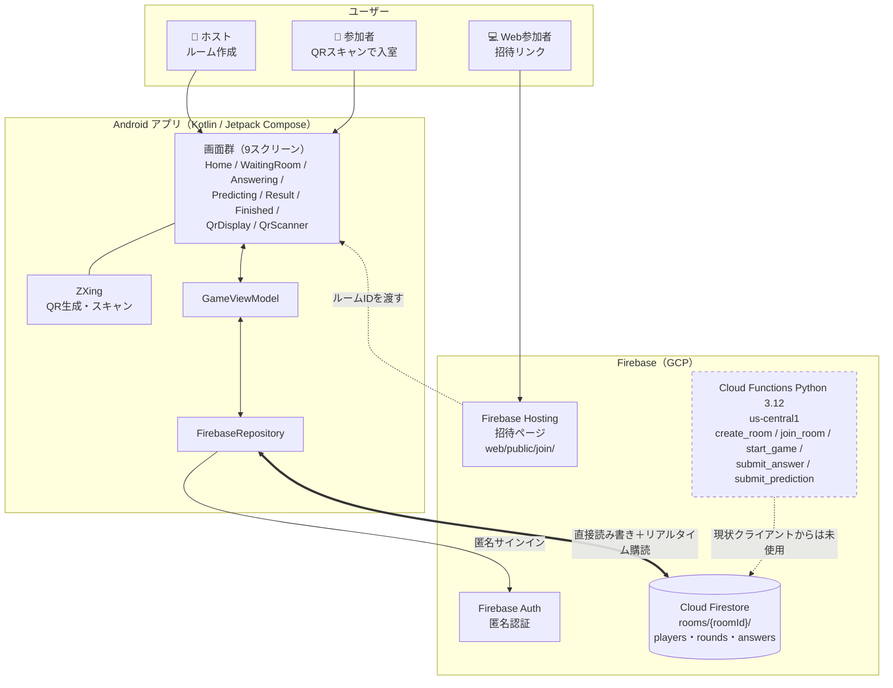

# 人数当てゲーム

複数人でQRコードを使ってグループを作り、Yes/No質問への回答人数を当てるリアルタイムゲームアプリ。
株式会社六創堂の技術アピール用プロダクト。

---

## ゲームフロー

1. **ルーム作成** — ホストがルームを作成し、ルームIDを発行
2. **入室** — 参加者がルームIDを入力して入室（AndroidアプリまたはWebブラウザ）
3. **回答** — 全員に同じYes/No質問が表示される（例：「犬を飼ったことがある？」）。「はい」か「いいえ」で回答
4. **予測** — 「はい」を選んだのは何人か予測して入力
5. **採点** — 予測が実際の人数に近いほど高得点（最大100点）
6. **結果表示** — ラウンドごとにランキング表示、5問終了後に最終順位を発表

### 採点方式

```
得点 = max(0, 100 - |予測人数 - 実際の人数| × 20)
```

ぴったり当てると100点、1人ずれるごとに20点減点。

---

## 技術スタック

| 領域 | 技術 |
|------|------|
| Androidアプリ | Kotlin / Jetpack Compose |
| Webクライアント | HTML / JavaScript（Firebase SDK） |
| データベース | Firebase Cloud Firestore |
| 認証 | Firebase Authentication（匿名認証） |
| ホスティング | Firebase Hosting |
| QRコード生成 | ZXing（Android） |

---

## アーキテクチャ / 構成図



### 構成上のポイント

- **リアルタイム同期は Firestore リスナー**（`addSnapshotListener`）で実現。WebSocket やポーリングは使っていません
- **QRコードは Android 側で完結**。生成（`QrDisplayScreen`）もスキャン（`QrScannerScreen`）もアプリ内で、サーバー生成は不要です
- **認証は匿名認証**。アカウント登録なしで即プレイできます
- Cloud Functions（`backend/functions/main.py`）にゲームロジックが実装済みですが、**現在 Android クライアントは Firestore を直接読み書き**しており、Functions は経由していません（図中の破線）

### セキュリティ（Firestore ルール）

`firestore.rules` は**ルーム単位の権限**で保護しています。「そのルームの参加者だけ」がルーム配下を読み書きでき、無関係な第三者は操作できません。

| パス | read | create | update | delete |
|---|---|---|---|---|
| `rooms/{roomId}` | 認証済み | `hostUid == 自分` | 参加者 | ホスト |
| `players/{uid}` | 参加者 | 自分のみ | 自分のみ | 自分 or ホスト |
| `rounds/{n}/answers/{uid}` | 参加者 | 参加者かつ自分 | 参加者※ | ホスト |

ルーム本体の read だけ認証済みに開放しているのは、`joinRoom()` が入室前に存在確認・満員判定でルームを読む必要があるためです。配下の `players` / `rounds` は参加者以外に読ませません。

> ⚠️ **※ スコア改ざんは防ぎきれていません。** 採点はクライアントが実行し、実行者は「最後に予測を送信したプレイヤー」でホストとは限りません（`finalizeRound`）。この処理が他プレイヤーの `roundScore` を書くため、`answers` の update を自分のドキュメントに限定できず、**同一ルームの参加者による改ざんはルール層では防げません**。
>
> 無関係な第三者による覗き見・妨害は塞げています。根本的に塞ぐにはゲームロジックを Cloud Functions 側へ移す必要があり、Google Play 公開を本格的に狙う段階で再検討する想定です。

ルールのテストは `backend/rules-tests/` にあります（権限マトリクス24件＋実ゲームフロー8件）。

```bash
cd backend
npm --prefix rules-tests install
npm --prefix rules-tests run test:emulator
```

> `test_game_flow.py` は firebase-admin SDK を使うため**ルールを迂回**します。ルール変更の影響を確認するときは上記のテストを使ってください。

### CI（自動テスト）

`main` 宛の Pull Request と `main` への push で [`.github/workflows/ci.yml`](.github/workflows/ci.yml) が自動実行されます。

- `backend/test_logic.py`（採点ロジック単体テスト）
- `backend/rules-tests/`（Firestoreルールテスト・権限マトリクス24件＋実ゲームフロー8件、Firebase Emulator上で実行）
- lint（Python: flake8）

テストが1件でも失敗するとCIが失敗（レッド）になり、PR上にステータスとして表示されます。
`test_functions.py` は本番Firestoreに直接書き込むスクリプトのため、CIには含めていません（手動実行のみ）。

詳細は [docs/architecture.md](docs/architecture.md) を参照。

---

## ディレクトリ構成

```
hitokazu-game/
├── README.md
├── android/              # Androidアプリ（Kotlin / Jetpack Compose）
│   └── app/src/main/java/com/rokusoudo/hitokazu/
│       ├── data/
│       │   ├── firebase/FirebaseRepository.kt  # Firestore操作
│       │   └── model/Models.kt                 # データモデル
│       ├── ui/
│       │   ├── screens/   # 各画面のComposable
│       │   └── components/
│       └── viewmodel/GameViewModel.kt
├── backend/
│   ├── firebase.json      # Firebase設定
│   ├── firestore.rules    # Firestoreセキュリティルール
│   ├── firestore.indexes.json
│   └── web/
│       └── index.html     # Webクライアント（ブラウザ参加用）
└── docs/                  # 仕様・要件（バックログは GitHub Issue が正）
```

---

## アーキテクチャ

AndroidアプリおよびWebクライアントから **Firebase Firestore に直接書き込む** 構成。
Firebase匿名認証でユーザーを識別し、Firestoreセキュリティルールで認証済みユーザーのみ読み書きを許可。

```
Android / ブラウザ
    │
    ├── Firebase Auth（匿名認証）
    │
    └── Cloud Firestore（リアルタイム同期）
            ├── rooms/{roomId}
            ├── rooms/{roomId}/players/{playerId}
            └── rooms/{roomId}/rounds/{round}/answers/{playerId}
```

### Firestoreデータ構造

**rooms/{roomId}**
```json
{
  "hostName": "string",
  "status": "WAITING | ANSWERING | PREDICTING | RESULT | FINISHED",
  "currentRound": 1,
  "totalRounds": 5,
  "currentQuestion": {
    "questionId": "q001",
    "text": "犬を飼ったことがある？",
    "options": ["はい", "いいえ"],
    "answerSeconds": 30,
    "predictSeconds": 20
  },
  "answerCounts": { "はい": 3, "いいえ": 2 },
  "roundScores": [...],
  "finalScores": [...]
}
```

---

## ゲームの状態遷移

```
WAITING → ANSWERING → PREDICTING → RESULT → ANSWERING → ...→ FINISHED
```

- 全員が回答したら自動で `PREDICTING` へ遷移
- 全員が予測したら自動で `RESULT` へ遷移
- ホストが10秒後に自動で次ラウンド（`ANSWERING`）へ進行
- 最終ラウンド終了後は `FINISHED` へ遷移

---

## 質問リスト（5問）

| No. | 質問 |
|-----|------|
| 1 | 犬を飼ったことがある？ |
| 2 | 朝ごはんを毎日食べる？ |
| 3 | 運転免許を持っている？ |
| 4 | 海外に行ったことがある？ |
| 5 | コーヒーを毎日飲む？ |

---

## セットアップ

### 前提条件

- Android Studio（Androidアプリビルド用）
- Java 17
- Firebase CLIツール（`npm install -g firebase-tools`）
- Firebaseプロジェクト（`hitokazu-game`）

### Androidアプリ

```bash
cd android
./gradlew assembleDebug
adb install -r app/build/outputs/apk/debug/app-debug.apk
```

### Webクライアント

```bash
cd backend
firebase deploy --only hosting
```

アクセスURL: https://hitokazu-game.web.app

### Firestoreルール

```bash
cd backend
firebase deploy --only firestore:rules
```

---

## プレイ方法

1. ホストがAndroidアプリ or ブラウザでルームを作成
2. 参加者にルームIDを共有
3. 参加者がAndroidアプリ or ブラウザでルームIDを入力して入室
4. ホストが「ゲームを開始する」をタップ
5. 各プレイヤーが質問に「はい」か「いいえ」で回答
6. 「はい」を選んだ人数を予測して送信
7. 結果確認後、自動で次の問題へ
8. 5問終了後に最終ランキングを表示

---

## 開発体制

| 役割 | 担当 |
|------|------|
| プロダクトオーナー | POエージェント（Claude） |
| エンジニア | エンジニアエージェント（Claude） |

---

## AI自動修正ワークフロー

GitHubのissueに問題を報告すると、Claude AIが自動でコードを修正してPRを作成します。

### ワークフロー図

```
開発者
  │
  │ 1. issueを作成（バグ報告・改善要望）
  ▼
GitHub Issues
  │
  │ 2. コメントに /fix と投稿
  ▼
GitHub Actions
  │
  ├── 3. リポジトリをチェックアウト
  │
  ├── 4. Claude Code CLI を起動
  │         │
  │         │  ANTHROPIC_API_KEY
  │         ▼
  │     Anthropic API（Claude Sonnet）
  │         │
  │         │ issueの内容を読んでコードを修正
  │         ▼
  │     修正済みコード
  │
  ├── 5. 新しいブランチにコミット＆プッシュ
  │
  └── 6. Pull Requestを自動作成
            │
            │ 7. 開発者がレビュー＆マージ
            ▼
          main ブランチに反映
```

### 使い方

**1. issueを作成する**

GitHubの [Issues](https://github.com/rokusoudo-product/qa-count-hit-game/issues/new) から問題を報告します。
修正内容が伝わるよう、具体的に記述してください。

```
タイトル例: 結果画面でニックネームではなくIDが表示される

本文例:
## 問題
結果画面のランキングにユーザーのニックネームではなく
Firebase UIDのハッシュ値が表示されている。

## 期待する動作
入室時に入力したニックネームが表示される。
```

**2. `/fix` とコメントする**

issueのコメント欄に以下を投稿するだけです。

```
/fix
```

**3. PRが自動作成される**

数分後にClaudeが修正コードを含むPRを自動作成します。
内容を確認してmainブランチにマージしてください。

### ワークフロー設定ファイル

`.github/workflows/claude-fix.yml`
