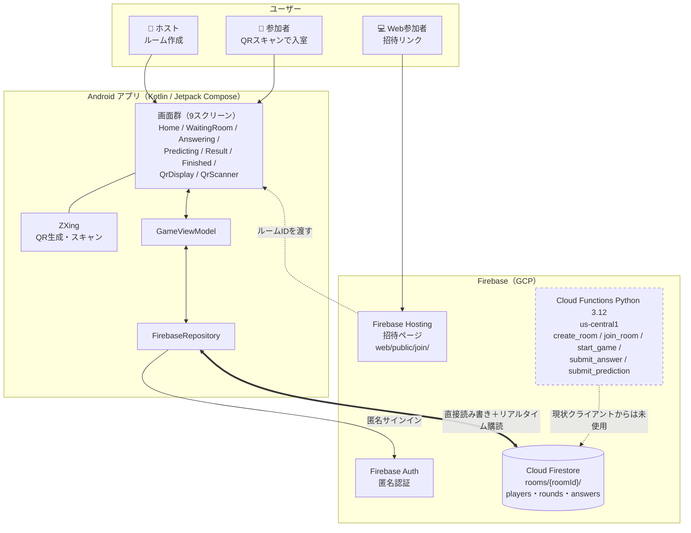

# 人数当てゲーム

複数人でQRコードを使ってグループを作り、Yes/No質問への回答人数を当てるリアルタイムゲームアプリ。
株式会社六創堂の技術アピール用プロダクト。

---

## ゲームフロー

1. **ルーム作成** — ホストがルームを作成し、ルームIDを発行
2. **入室** — 参加者がルームIDを入力して入室（AndroidアプリまたはWebブラウザ）
3. **回答** — 全員に同じYes/No質問が表示される（例：「犬を飼ったことがある？」）。「はい」か「いいえ」で回答
4. **予測** — 「はい」を選んだのは何人か予測して入力
5. **採点** — 予測が実際の人数に近いほど高得点（最大100点）
6. **結果表示** — ラウンドごとにランキング表示、5問終了後に最終順位を発表

### 採点方式

```
得点 = max(0, 100 - |予測人数 - 実際の人数| × 20)
```

ぴったり当てると100点、1人ずれるごとに20点減点。

---

## 技術スタック

| 領域 | 技術 |
|------|------|
| Androidアプリ | Kotlin / Jetpack Compose |
| Webクライアント | HTML / JavaScript（Firebase SDK） |
| データベース | Firebase Cloud Firestore |
| 認証 | Firebase Authentication（匿名認証） |
| ホスティング | Firebase Hosting |
| QRコード生成 | ZXing（Android） |

---

## アーキテクチャ / 構成図



### 構成上のポイント

- **リアルタイム同期は Firestore リスナー**（`addSnapshotListener`）で実現。WebSocket やポーリングは使っていません
- **QRコードは Android 側で完結**。生成（`QrDisplayScreen`）もスキャン（`QrScannerScreen`）もアプリ内で、サーバー生成は不要です
- **認証は匿名認証**。アカウント登録なしで即プレイできます
- Cloud Functions（`backend/functions/main.py`）にゲームロジックが実装済みですが、**現在 Android クライアントは Firestore を直接読み書き**しており、Functions は経由していません（図中の破線）

### セキュリティ（Firestore ルール）

`firestore.rules` は**ルーム単位の権限**で保護しています。「そのルームの参加者だけ」がルーム配下を読み書きでき、無関係な第三者は操作できません。

| パス | read | create | update | delete |
|---|---|---|---|---|
| `rooms/{roomId}` | 認証済み | `hostUid == 自分` | 参加者 | ホスト |
| `players/{uid}` | 参加者 | 自分のみ・nickname検証 | 自分のみ・nickname検証 | 自分 or ホスト |
| `rounds/{n}/answers/{uid}` | 参加者 | 参加者かつ自分 | 参加者※ | ホスト |

ルーム本体の read だけ認証済みに開放しているのは、`joinRoom()` が入室前に存在確認・満員判定でルームを読む必要があるためです。配下の `players` / `rounds` は参加者以外に読ませません。

**nickname の検証**: `players/{uid}` の `create` / `update` では、`nickname` が **string かつ 1〜20文字**であることをルール層で検証しています（Web の `maxlength="20"` / Android の入力上限と統一）。クライアントの表示制限だけでは DevTools 等から迂回できるため、不正な値（非文字列・21文字以上・空文字）の保存自体を Firestore 側で拒否します。あわせて Web クライアント側でも、ニックネームを画面に描画する3箇所（待合室のプレイヤー一覧・ラウンド結果ランキング・最終結果ランキング）で `innerHTML` へのエスケープなし埋め込みをやめ、`escapeHtml()` によるエスケープまたは `textContent` ベースの構築に変更し、保存型XSSを防いでいます（Issue #36）。

> ⚠️ **※ スコア改ざんは防ぎきれていません。** 採点はクライアントが実行し、実行者は「最後に予測を送信したプレイヤー」でホストとは限りません（`finalizeRound`）。この処理が他プレイヤーの `roundScore` を書くため、`answers` の update を自分のドキュメントに限定できず、**同一ルームの参加者による改ざんはルール層では防げません**。
>
> 無関係な第三者による覗き見・妨害、および参加者によるニックネーム経由の XSS は塞げています。スコア改ざんを根本的に塞ぐにはゲームロジックを Cloud Functions 側へ移す必要があり、Google Play 公開を本格的に狙う段階で再検討する想定です。

ルールのテストは `backend/rules-tests/` にあります（権限マトリクス32件〔nicknameの検証7件を含む〕＋実ゲームフロー18件）。

```bash
cd backend
npm --prefix rules-tests install
npm --prefix rules-tests run test:emulator
```

> `test_game_flow.py` は firebase-admin SDK を使うため**ルールを迂回**します。ルール変更の影響を確認するときは上記のテストを使ってください。

### CI（自動テスト）

`main` 宛の Pull Request と `main` への push で [`.github/workflows/ci.yml`](.github/workflows/ci.yml) が自動実行されます。

- `backend/test_logic.py`（採点ロジック単体テスト）
- `backend/test_questions_sync.py`（質問マスタの正本と3実装の同期検証）
- `backend/rules-tests/`（Firestoreルールテスト・権限マトリクス32件〔nicknameの検証7件を含む〕＋実ゲームフロー18件、Firebase Emulator上で実行）
- `backend/test_room_expiry.py`（ルーム保持期限・自動削除のEmulator統合テスト。詳細は下記「ルームの保持期間と自動削除」）
- lint（Python: flake8 / JS: rules-tests に設定があれば実行）

テストが1件でも失敗するとCIが失敗（レッド）になり、PR上にステータスとして表示されます。
`test_functions.py` は本番Firestoreに直接書き込むスクリプトのため、CIには含めていません（手動実行のみ）。

詳細は [docs/architecture.md](docs/architecture.md) を参照。

---

## ディレクトリ構成

```
hitokazu-game/
├── README.md
├── android/              # Androidアプリ（Kotlin / Jetpack Compose）
│   └── app/src/main/java/com/rokusoudo/hitokazu/
│       ├── data/
│       │   ├── firebase/FirebaseRepository.kt  # Firestore操作
│       │   └── model/Models.kt                 # データモデル
│       ├── ui/
│       │   ├── screens/   # 各画面のComposable
│       │   └── components/
│       └── viewmodel/GameViewModel.kt
├── backend/
│   ├── firebase.json      # Firebase設定
│   ├── firestore.rules    # Firestoreセキュリティルール
│   ├── firestore.indexes.json
│   └── web/
│       └── index.html     # Webクライアント（ブラウザ参加用）
└── docs/                  # 仕様・要件（バックログは GitHub Issue が正）
```

---

## アーキテクチャ

AndroidアプリおよびWebクライアントから **Firebase Firestore に直接書き込む** 構成。
Firebase匿名認証でユーザーを識別し、Firestoreセキュリティルールで認証済みユーザーのみ読み書きを許可。

```
Android / ブラウザ
    │
    ├── Firebase Auth（匿名認証）
    │
    └── Cloud Firestore（リアルタイム同期）
            ├── rooms/{roomId}
            ├── rooms/{roomId}/players/{playerId}
            └── rooms/{roomId}/rounds/{round}/answers/{playerId}
```

### Firestoreデータ構造

**rooms/{roomId}**
```json
{
  "hostName": "string",
  "hostUid": "string",
  "status": "WAITING | ANSWERING | PREDICTING | RESULT | FINISHED",
  "currentRound": 1,
  "totalRounds": 5,
  "category": "ALL | FRIEND | PARTY | DEEP",
  "currentQuestion": {
    "questionId": "f001",
    "text": "犬を飼ったことがある？",
    "options": ["はい", "いいえ"],
    "answerSeconds": 30,
    "predictSeconds": 20,
    "tags": ["friend"]
  },
  "questionQueue": [...],
  "answerCounts": { "はい": 3, "いいえ": 2 },
  "roundScores": [...],
  "finalScores": [...],
  "cumulativeTotals": { "<playerId>": 240 },
  "nextRound": 2,
  "phaseStartedAt": "timestamp",
  "gameCount": 1,
  "createdAt": "timestamp",
  "startedAt": "timestamp",
  "finishedAt": "timestamp",
  "expireAt": "timestamp"
}
```

- `hostUid` は Firestore ルールのホスト判定に使います
- `phaseStartedAt` は**タイムアウト判定の基準となるサーバー時刻**です（下記「ゲームの状態遷移」）
- `expireAt` は**ルームの保持期限**です（下記「ルームの保持期間と自動削除」）
- 各フィールドの型・書き込み箇所を含む網羅的な一覧は [docs/architecture.md](docs/architecture.md#firestore-データ構造) にあります。
  実装を変更するときはそちらを正としてください

---

## ゲームの状態遷移

```
WAITING → ANSWERING → PREDICTING → RESULT → ANSWERING → ...→ FINISHED → (再戦) WAITING
```

- 全員が回答したら自動で `PREDICTING` へ遷移
- 全員が予測したら自動で `RESULT` へ遷移
- ホストが10秒後に自動で次ラウンド（`ANSWERING`）へ進行
- 最終ラウンド終了後は `FINISHED` へ遷移
- ホストが終了画面で「もう一度遊ぶ」を押すと、同一ルームのまま `WAITING` に戻る（参加者はルームID再入力・QR再スキャン不要）。「トップに戻る」はルームを離脱するだけで `WAITING` には戻らない。詳細は [docs/architecture.md](docs/architecture.md#フェーズ状態遷移)

### タイムアウトによる遷移

**全員が提出しなくてもフェーズは進みます。** 1人が離席・通信断を起こしただけでゲームが止まらないようにするためです。

- `ANSWERING` は `answerSeconds`（既定30秒）＋猶予3秒、`PREDICTING` は `predictSeconds`（既定20秒）＋猶予3秒が経過すると、**ホスト端末が提出済みの分だけで確定**させて次のフェーズへ進めます
- 判定の基準時刻は端末のローカル時計ではなく、ルームドキュメントの `phaseStartedAt`（サーバー時刻）から算出します。途中参加・画面復帰した端末でも基準がズレません
- 未提出者は当該ラウンドのスコア集計から除外されます

---

## ルームの保持期間と自動削除

ルームとその配下のデータ（`players` / `rounds` / `rounds/*/answers`。ニックネームを含む）は、
Firestore にため込まれ続けないよう**保持期限を過ぎると自動的に削除**されます（Issue #34）。

| 状態 | 保持期間 |
|---|---|
| 終了済み（`FINISHED` / `HOST_LEFT`） | 終了から **24時間** |
| それ以外（待合室・ラウンド確定のたび・再戦直後） | 基準時刻から **6時間** |

- ルームドキュメントの `expireAt` フィールドがこの期限を表し、ルーム作成・各ラウンド確定・
  ホスト離脱検知・再戦のたびに更新されます。**遊び続けている限り毎ラウンドの確定で延長されるため
  実質失効しません**
- 削除は1日1回のスケジュール Cloud Function `delete_expired_rooms`（`backend/functions/main.py`）が行います。
  Firestore の TTL ポリシーは親ドキュメントの削除だけでサブコレクションを削除しないため、
  Firebase Admin SDK の `firestore.recursive_delete()` で `players` / `rounds` / `rounds/*/answers` を
  含めて再帰的に削除します
- `expireAt` を持たない旧ルーム（本Issue導入前に作成された分）は、`createdAt` から24時間を超えていれば
  フォールバックとして削除対象になります
- 初回デプロイ時はスケジュール関数のデプロイと同時に Cloud Scheduler ジョブが自動作成されます：
  `cd backend && firebase deploy --only functions`
- 検証は `backend/test_room_expiry.py`（Firestore Emulator）で行っています。詳細は
  [docs/architecture.md](docs/architecture.md#ルームの保持期限と自動削除issue-34) を参照

---

## 質問マスタ（36問）

質問は全部で **36問**あり、**1ゲームではそこから5問**が抽選されて出題されます（`TOTAL_ROUNDS_PER_GAME = 5`）。

質問の内容は [`shared/questions.json`](shared/questions.json) が**単一の正本**です。README には転記しません（二重管理を避けるため）。

各質問はカテゴリタグを持ち、ルーム作成時に選んだカテゴリで絞り込まれます。

| カテゴリ | タグ | 用途 |
|---|---|---|
| なんでも | `friend` + `party` + `deep` | 既定。全36問から抽選 |
| フレンド | `friend` | 気軽な話題 |
| パーティー | `party` | 場を盛り上げる話題 |
| ディープ | `deep` | 関係性が近い相手・成人向けの話題 |

質問を追加・変更するときは `shared/questions.json` を編集し、生成スクリプトで Kotlin / JavaScript / Python の3実装へ反映します。

```bash
python3 scripts/generate_questions.py         # 3実装へ反映
python3 scripts/generate_questions.py --check # 同期しているか検証（CI で実行）
```

生成先（`data/questions/Questions.kt` / `backend/functions/questions.py` / `backend/web/index.html` の生成マーカー区間）は**直接編集しないでください**。詳細は [docs/architecture.md](docs/architecture.md) を参照。

---

## セットアップ

### 前提条件

- Android Studio（Androidアプリビルド用）
- Java 17
- Firebase CLIツール（`npm install -g firebase-tools`）
- Firebaseプロジェクト（`hitokazu-game`）

### Androidアプリ

```bash
cd android
./gradlew assembleDebug
adb install -r app/build/outputs/apk/debug/app-debug.apk
```

### Webクライアント

```bash
cd backend
firebase deploy --only hosting
```

アクセスURL: https://hitokazu-game.web.app

### Firestoreルール

```bash
cd backend
firebase deploy --only firestore:rules
```

### Cloud Functions

```bash
cd backend
firebase deploy --only functions
```

スケジュール関数（`delete_expired_rooms`）を含む。初回デプロイ時に Cloud Scheduler ジョブが自動作成される（Blaze プラン必須）。

---

## プレイ方法

1. ホストがAndroidアプリ or ブラウザでルームを作成
2. 参加者にルームIDを共有
3. 参加者がAndroidアプリ or ブラウザでルームIDを入力して入室
4. ホストが「ゲームを開始する」をタップ
5. 各プレイヤーが質問に「はい」か「いいえ」で回答
6. 「はい」を選んだ人数を予測して送信
7. 結果確認後、自動で次の問題へ
8. 5問終了後に最終ランキングを表示

---

## 開発体制

| 役割 | 担当 |
|------|------|
| プロダクトオーナー | POエージェント（Claude） |
| エンジニア | エンジニアエージェント（Claude） |

---

## AI自動修正ワークフロー

GitHubのissueに `ready` ラベルが付くと、po_agent（Sonnetサブエージェント）が自動で実装してPRを作成します。

> 過去バージョンでは `issue_comment` イベントをトリガーに `.github/workflows/claude-fix.yml` が
> コメント投稿者の権限を確認せず `contents: write` 等の権限で自律エージェントを起動していたため、
> 本リポジトリがpublicである以上、第三者がissueコメント一つでシークレット窃取やmainへの任意コミットを
> 引き起こせる状態でした。このワークフローは廃止し、実装の起動は代表によるラベル付け（`ready`）を
> 起点とする下記フローに置き換えています。

### ワークフロー図

```
代表
  │
  │ 1. issueを確認し、実装OKなら ready ラベルを付与
  ▼
GitHub Issues（ready あり・question / future なし）
  │
  │ 2. 毎日午前3時: スケジュールタスク po-agent-daily-issue-check
  ▼
po_agent（Sonnetサブエージェント）
  │
  ├── 3. 対象issueを最大3件選定
  │
  ├── 4. issueごとにブランチを作成し実装
  │
  └── 5. Pull Requestを作成（本文に Closes #<番号> を記載）
            │
            │ 6. 代表がレビュー＆マージを判断（自動マージはしない）
            ▼
          main ブランチに反映
```

### 使い方

**1. issueを作成する**

GitHubの [Issues](https://github.com/rokusoudo-product/qa-count-hit-game/issues/new) から問題を報告します。
修正内容が伝わるよう、具体的に記述してください。

```
タイトル例: 結果画面でニックネームではなくIDが表示される

本文例:
## 問題
結果画面のランキングにユーザーのニックネームではなく
Firebase UIDのハッシュ値が表示されている。

## 期待する動作
入室時に入力したニックネームが表示される。
```

**2. 代表が `ready` ラベルを付ける**

未解決の質問（`question` ラベル）がなく、実装を保留する理由（`future` ラベル）もない場合に、
代表がissueに `ready` ラベルを付けます。これが実装開始の合図です。

**3. PRが自動作成される**

毎日午前3時のスケジュールタスクがpo_agentに委譲し、`ready` かつ `question`/`future` なしのissueを
最大3件実装してPRを作成します。PR本文には対象issueへの `Closes #<番号>` が記載されます。
マージは代表が内容を確認したうえで行います（自動マージはしません）。
