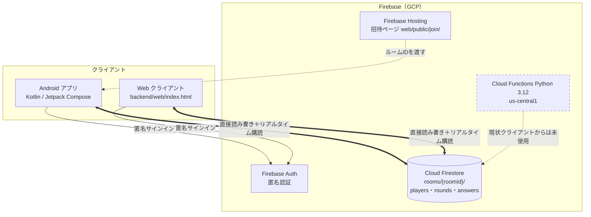

# システムアーキテクチャ概要

**作成日**: 2026-03-20
**最終更新**: 2026-08-06（実装との乖離を解消。Issue #19）
**バージョン**: 3.0

---

## 全体構成図



### 最重要の前提

**ゲームロジックはクライアント側にあり、クライアントは Firestore を直接読み書きする。**
`backend/functions/main.py` に Cloud Functions が実装済みだが、**Android・Web のどちらからも呼び出していない**（図中の破線）。実装を読む・変更するときはこの前提を誤らないこと。

この構成の帰結:

- 採点・フェーズ遷移・タイムアウト確定はすべてクライアントが実行する
- そのためスコア改ざんは Firestore ルールだけでは防ぎきれない（後述「セキュリティ」）
- 将来ロジックをサーバー側へ移す場合は、既存の Cloud Functions が出発点になる

---

## Firebase 構成

| コンポーネント | サービス | 用途 | 現状 |
|--------------|---------|------|------|
| リアルタイムDB | Cloud Firestore | ゲーム状態・プレイヤー・回答管理 | ✅ 使用中 |
| 認証 | Firebase Authentication（匿名） | プレイヤー識別（uid） | ✅ 使用中 |
| ホスティング | Firebase Hosting | 招待ページ `web/public/join/` | ✅ 使用中 |
| リアルタイム通信 | Firestore リスナー（`addSnapshotListener`） | WebSocket 代替 | ✅ 使用中 |
| サーバーレス関数 | Cloud Functions (Python 3.12 / us-central1) | ゲームロジック・採点 | ⚠️ **実装済みだが未使用** |

---

## Firestore データ構造

実装（`android/.../data/model/Models.kt` と `data/firebase/FirebaseRepository.kt`）に一致させること。

### `rooms/{roomId}`

| フィールド | 型 | 書き込み箇所 | 説明 |
|---|---|---|---|
| `hostName` | string | createRoom | ホストのニックネーム |
| `hostUid` | string | createRoom | ホストの Firebase uid。ルール判定に使う |
| `status` | string | 各所 | `WAITING` / `ANSWERING` / `PREDICTING` / `RESULT` / `FINISHED` |
| `currentRound` | number | createRoom / startGame / 次ラウンド | 現在のラウンド番号 |
| `totalRounds` | number | createRoom / startGame | 1ゲームの出題数（既定5） |
| `category` | string | createRoom | `QuestionCategory` の名前（`ALL` / `FRIEND` / `PARTY` / `DEEP`） |
| `currentQuestion` | map | createRoom / startGame / 次ラウンド | `{ questionId, text, options, answerSeconds, predictSeconds, tags }` |
| `questionQueue` | array\<map\> | startGame | ゲーム開始時に抽選した出題リスト |
| `answerCounts` | map\<string,number\> | 予測フェーズ移行時 | 選択肢ごとの回答人数 |
| `roundScores` | array\<PlayerScore\> | ラウンド確定時 | 当該ラウンドのスコア |
| `finalScores` | array\<PlayerScore\> | ゲーム終了時 | 最終スコア |
| `cumulativeTotals` | map | ラウンド確定時 / 終了時 | プレイヤーごとの累計得点 |
| `nextRound` | number | ラウンド確定時 | 次に進むラウンド番号 |
| `phaseStartedAt` | timestamp | フェーズ遷移時 | **現フェーズの開始サーバー時刻。タイムアウト判定の基準**（Issue #14） |
| `createdAt` | timestamp | createRoom | ルーム作成時刻 |
| `startedAt` | timestamp | startGame | ゲーム開始時刻 |
| `finishedAt` | timestamp | ゲーム終了時 | ゲーム終了時刻 |

`PlayerScore` の構造: `{ playerId, nickname, targetOption, predictedCount, actualCount, roundScore, totalScore }`

### `rooms/{roomId}/players/{uid}`

| フィールド | 型 | 説明 |
|---|---|---|
| `nickname` | string | 表示名 |
| `isHost` | boolean | ホストかどうか |
| `joinedAt` | timestamp | 入室時刻 |

### `rooms/{roomId}/rounds/{round}/answers/{uid}`

| フィールド | 型 | 説明 |
|---|---|---|
| `answer` | string | 選択した選択肢 |
| `answeredAt` | timestamp | 回答時刻 |
| `prediction` | number | 予測人数 |
| `targetOption` | string | 予測対象の選択肢 |
| `predictedAt` | timestamp | 予測時刻 |
| `roundScore` | number | 採点結果（確定時に書き込まれる） |

### ルームID

`FirebaseRepository.generateRoomId()` が生成する **8桁のランダム文字列**。
文字集合は `ABCDEFGHJKLMNPQRSTUVWXYZ23456789`（32文字）で、誤読しやすい `I` / `O` / `0` / `1` を除いてある。
**UUID ではない**（口頭・手入力で共有するため短くしている）。

---

## Cloud Functions 一覧（現状クライアントからは未使用）

`backend/functions/main.py`。HTTPS 関数として `us-central1` にデプロイされる。

| 関数名 | 説明 |
|--------|------|
| `create_room` | ルームID生成・Firestore 保存 |
| `join_room` | プレイヤー参加・バリデーション |
| `start_game` | ゲーム開始・最初の質問セット |
| `submit_answer` | 回答保存・全員完了で予測フェーズ移行 |
| `submit_prediction` | 予測保存・採点・次ラウンド/終了 |

> ⚠️ **これらは現役の API ではない。** クライアントは Firestore を直接読み書きしており、この5関数を呼んでいない。ロジックをサーバー側へ移す判断をした時点で、改めて現行のクライアント実装と突き合わせる必要がある。

---

## フェーズ状態遷移

```
WAITING（待合室）
  ↓ ホストがゲーム開始
ANSWERING（回答フェーズ：既定 answerSeconds = 30秒）
  ↓ 全員回答完了、または answerSeconds + 猶予3秒の経過（ホスト端末が確定）
PREDICTING（予測フェーズ：既定 predictSeconds = 20秒）
  ↓ 全員予測完了、または predictSeconds + 猶予3秒の経過（ホスト端末が確定）
RESULT（結果表示：10秒）
  ↓ 次のラウンドへ or ゲーム終了
FINISHED（最終結果）
```

- 状態変更は Firestore ドキュメントの更新で行い、各クライアントは `addSnapshotListener` で自動検知して UI を更新する
- **タイムアウトはホスト端末が主導して確定させる**（Issue #14）。基準時刻は端末のローカル時計ではなく `phaseStartedAt`（サーバー時刻）から算出するため、途中参加・画面復帰した端末でもズレない
- 未提出者は当該ラウンドのスコア集計から除外される

> ⚠️ ホスト自身が離脱するとタイムアウト確定を実行する主体がいなくなる。この扱いは Issue #15 で対応する（Firestore ハートビートで検知し、ルームを終了する方針で確定済み）。

---

## スコア計算式

```
差分 = |予測値 - 実際の人数|
スコア = max(0, 100 - 差分 × 20)
```

ぴったり当てると100点、1人ずれるごとに20点減点。実装は `FirebaseRepository` と `backend/test_logic.py` にある。

---

## 質問マスタ（Issue #16）

質問マスタ（36問）は **`shared/questions.json` が単一の正本**で、次の3実装はそこから生成される。**生成物を直接編集しないこと。**

- `android/app/src/main/java/com/rokusoudo/hitokazu/data/questions/Questions.kt`
- `backend/functions/questions.py`
- `backend/web/index.html`（`// GENERATED:QUESTIONS:START` 〜 `:END` の区間）

```bash
python3 scripts/generate_questions.py         # 3実装へ反映
python3 scripts/generate_questions.py --check # 同期検証のみ（CI で実行）
```

各質問は `tags`（`friend` / `party` / `deep`）を持ち、ルームの `category` で絞り込まれる。

> ⚠️ カテゴリによる絞り込みは**現状 Android 側にしか実装がない**。Web クライアントは全問から抽選する。是正は Issue #12。

---

## セキュリティ（Firestore ルール）

`backend/firestore.rules` は**ルーム単位の権限**で保護している。

| パス | read | create | update | delete |
|---|---|---|---|---|
| `rooms/{roomId}` | 認証済み | `hostUid == 自分` | 参加者 | ホスト |
| `players/{uid}` | 参加者 | 自分のみ | 自分のみ | 自分 or ホスト |
| `rounds/{n}/answers/{uid}` | 参加者 | 参加者かつ自分 | 参加者※ | ホスト |

ルーム本体の read だけ認証済みに開放しているのは、`joinRoom()` が入室前に存在確認・満員判定でルームを読む必要があるため。

> ⚠️ **※ スコア改ざんは防ぎきれていない。** 採点はクライアントが実行し、実行者は「最後に予測を送信したプレイヤー」でホストとは限らない。この処理が他プレイヤーの `roundScore` を書くため、`answers` の update を自分のドキュメントに限定できない。無関係な第三者による覗き見・妨害は塞げているが、**同一ルームの参加者による改ざんはルール層では防げない**。根本的に塞ぐにはゲームロジックを Cloud Functions 側へ移す必要がある。

ルールのテストは `backend/rules-tests/`（権限マトリクス24件＋実ゲームフロー8件）。

---

## テストと CI

| ファイル | 内容 | CI |
|---|---|---|
| `backend/test_logic.py` | 採点ロジック単体（Firestore 非依存） | ✅ |
| `backend/test_questions_sync.py` | 質問マスタの正本と3実装の一致検証 | ✅ |
| `backend/rules-tests/` | Firestore ルール（Emulator 上で32件） | ✅ |
| `backend/test_game_flow.py` | Emulator 統合テスト | — |
| `backend/test_functions.py` | ⚠️ **本番 Firestore に直接書き込む**。CI に含めない | ❌ |

`.github/workflows/ci.yml` が `main` 宛の PR と `main` への push で自動実行する（Issue #13）。lint（Python: flake8）も同ワークフローに含まれる。

---

## AWS からの移行メモ

旧 AWS 実装は `archive/` に保存済み。現行構成では使用しない。

| 旧（AWS） | 現行（Firebase） |
|---|---|
| WebSocket API Gateway | Firestore リアルタイムリスナー |
| Lambda | Cloud Functions（ただし現状未使用） |
| DynamoDB | Cloud Firestore |
| Terraform | Firebase CLI（`backend/firebase.json`） |

移行前のバックログは `archive/backlog_aws.md` に退避してある。**現行のバックログは GitHub Issue を正とする。**
