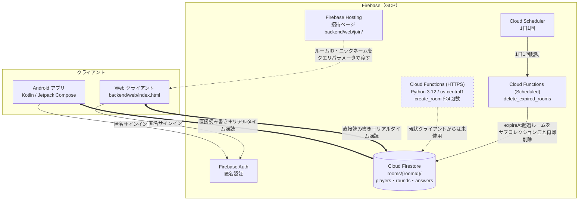

# システムアーキテクチャ概要

**作成日**: 2026-03-20
**最終更新**: 2026-08-13（ルーム保持期限・自動削除を追加。Issue #34）
**バージョン**: 3.1

---

## 全体構成図



### 最重要の前提

**ゲームロジックはクライアント側にあり、クライアントは Firestore を直接読み書きする。**
`backend/functions/main.py` の HTTPS Cloud Functions 5関数（`create_room` / `join_room` / `start_game` / `submit_answer` / `submit_prediction`）は実装済みだが、**Android・Web のどちらからも呼び出していない**（図中の破線）。実装を読む・変更するときはこの前提を誤らないこと。

一方、同じ `main.py` に定義されている `delete_expired_rooms`（スケジュール実行・Issue #34）は**クライアントを経由せず Cloud Scheduler が直接起動する**ため、上記の「未使用」の対象外。ルーム保持期限を過ぎたデータの削除という、クライアント側では実装しようがない役割を担う（後述「ルームの保持期限と自動削除」）。

この構成の帰結:

- 採点・フェーズ遷移・タイムアウト確定はすべてクライアントが実行する
- そのためスコア改ざんは Firestore ルールだけでは防ぎきれない（後述「セキュリティ」）
- 将来ロジックをサーバー側へ移す場合は、既存の Cloud Functions が出発点になる
- ただし削除処理（`delete_expired_rooms`）だけは例外的にサーバー側（Cloud Functions）で完結しており、クライアントは一切関与しない

---

## Firebase 構成

| コンポーネント | サービス | 用途 | 現状 |
|--------------|---------|------|------|
| リアルタイムDB | Cloud Firestore | ゲーム状態・プレイヤー・回答管理 | ✅ 使用中 |
| 認証 | Firebase Authentication（匿名） | プレイヤー識別（uid） | ✅ 使用中 |
| ホスティング | Firebase Hosting | ゲーム本体 `backend/web/index.html` ＋ 招待ページ `backend/web/join/`（`backend/firebase.json` の rewrite で振り分け） | ✅ 使用中 |
| リアルタイム通信 | Firestore リスナー（`addSnapshotListener`） | WebSocket 代替 | ✅ 使用中 |
| サーバーレス関数（HTTPS） | Cloud Functions (Python 3.12 / us-central1) | ゲームロジック・採点 | ⚠️ **実装済みだが未使用** |
| サーバーレス関数（スケジュール） | Cloud Functions (Python 3.12 / us-central1) + Cloud Scheduler | `delete_expired_rooms`：期限切れルームの自動削除（Issue #34） | ✅ 使用中 |

---

## Firestore データ構造

実装（`android/.../data/model/Models.kt` と `data/firebase/FirebaseRepository.kt`）に一致させること。

### `rooms/{roomId}`

| フィールド | 型 | 書き込み箇所 | 説明 |
|---|---|---|---|
| `hostName` | string | createRoom | ホストのニックネーム |
| `hostUid` | string | createRoom | ホストの Firebase uid。ルール判定に使う |
| `status` | string | 各所 | `WAITING` / `ANSWERING` / `PREDICTING` / `RESULT` / `FINISHED` |
| `currentRound` | number | createRoom / startGame / 次ラウンド | 現在のラウンド番号 |
| `totalRounds` | number | createRoom / startGame | 1ゲームの出題数（既定5） |
| `category` | string | createRoom | `QuestionCategory` の名前（`ALL` / `FRIEND` / `PARTY` / `DEEP`） |
| `currentQuestion` | map | createRoom / startGame / 次ラウンド | `{ questionId, text, options, answerSeconds, predictSeconds, tags }` |
| `questionQueue` | array\<map\> | startGame | ゲーム開始時に抽選した出題リスト |
| `answerCounts` | map\<string,number\> | 予測フェーズ移行時 | 選択肢ごとの回答人数 |
| `roundScores` | array\<PlayerScore\> | ラウンド確定時 | 当該ラウンドのスコア |
| `finalScores` | array\<PlayerScore\> | ゲーム終了時 | 最終スコア |
| `cumulativeTotals` | map | ラウンド確定時 / 終了時 | プレイヤーごとの累計得点 |
| `nextRound` | number | ラウンド確定時 | 次に進むラウンド番号 |
| `phaseStartedAt` | timestamp | フェーズ遷移時 | **現フェーズの開始サーバー時刻。タイムアウト判定の基準**（Issue #14） |
| `gameCount` | number | createRoom / restartGame | **再戦のたびにインクリメントする世代番号（既定1）。`rounds/{gameCount}_{round}` のドキュメントIDに使い、再戦後の2ゲーム目が前ゲームの回答と衝突しないようにする**（Issue #17） |
| `lastPlayedQuestionId` | string | restartGame（設定）/ startGame（削除） | 前ゲーム最終問題のID。再戦直後の1問目に同じ質問が連続しないよう startGame() が参照する一時フィールド |
| `createdAt` | timestamp | createRoom | ルーム作成時刻 |
| `startedAt` | timestamp | startGame | ゲーム開始時刻 |
| `finishedAt` | timestamp | ゲーム終了時 | ゲーム終了時刻 |
| `restartedAt` | timestamp | restartGame | 再戦を開始した時刻 |
| `expireAt` | timestamp | createRoom / finalizeRound（各ラウンド確定時） / terminateRoomHostLeft / restartGame | **ルームの保持期限。`delete_expired_rooms`（スケジュール Cloud Function）がこれを過ぎたルームをサブコレクションごと削除する**（Issue #34）。終了済み（FINISHED / HOST_LEFT）は終了時刻から24時間後、それ以外（作成時・ラウンド確定のたび・再戦時）は基準時刻から6時間後に更新される。遊び続けている限り毎ラウンドの確定で延長されるため実質失効しない。詳細は「ルームの保持期限と自動削除」を参照 |

`PlayerScore` の構造: `{ playerId, nickname, targetOption, predictedCount, actualCount, roundScore, totalScore }`

### `rooms/{roomId}/players/{uid}`

| フィールド | 型 | 説明 |
|---|---|---|
| `nickname` | string | 表示名 |
| `isHost` | boolean | ホストかどうか |
| `joinedAt` | timestamp | 入室時刻 |

### `rooms/{roomId}/rounds/{gameCount}_{round}/answers/{uid}`

> ドキュメントID（`{round}` のみだった旧仕様から `{gameCount}_{round}` に変更。Issue #17）。
> `restartGame()` は `gameCount` をインクリメントするだけで前ゲームの `rounds` ドキュメントは削除しない
> （履歴として残る）。そのため2ゲーム目の `round=1` が前ゲームの `round=1` と衝突せず、
> `submitAnswer()` の「すでに回答済みです」判定が誤爆しない。

| フィールド | 型 | 説明 |
|---|---|---|
| `answer` | string | 選択した選択肢 |
| `answeredAt` | timestamp | 回答時刻 |
| `prediction` | number | 予測人数 |
| `targetOption` | string | 予測対象の選択肢 |
| `predictedAt` | timestamp | 予測時刻 |
| `roundScore` | number | 採点結果（確定時に書き込まれる） |

### ルームID

`FirebaseRepository.generateRoomId()` が生成する **8桁のランダム文字列**。
文字集合は `ABCDEFGHJKLMNPQRSTUVWXYZ23456789`（32文字）で、誤読しやすい `I` / `O` / `0` / `1` を除いてある。
**UUID ではない**（口頭・手入力で共有するため短くしている）。

---

## Cloud Functions 一覧

`backend/functions/main.py`。`us-central1` にデプロイされる。

### HTTPS 関数（現状クライアントからは未使用）

| 関数名 | 説明 |
|--------|------|
| `create_room` | ルームID生成・Firestore 保存 |
| `join_room` | プレイヤー参加・バリデーション |
| `start_game` | ゲーム開始・最初の質問セット |
| `submit_answer` | 回答保存・全員完了で予測フェーズ移行 |
| `submit_prediction` | 予測保存・採点・次ラウンド/終了 |

> ⚠️ **これらは現役の API ではない。** クライアントは Firestore を直接読み書きしており、この5関数を呼んでいない。ロジックをサーバー側へ移す判断をした時点で、改めて現行のクライアント実装と突き合わせる必要がある。

### スケジュール関数（使用中）

| 関数名 | トリガー | 説明 |
|--------|---------|------|
| `delete_expired_rooms` | Cloud Scheduler（1日1回） | `expireAt` を過ぎたルーム、および `expireAt` 未設定の旧ルーム（`createdAt` から24時間超）を `firestore.recursive_delete()` でサブコレクションごと削除する（Issue #34）。詳細は「ルームの保持期限と自動削除」を参照 |

こちらは HTTPS 関数と異なり Cloud Scheduler が直接起動するため、クライアントの実装状況とは無関係に本番で稼働する。

---

## フェーズ状態遷移

```
WAITING（待合室）
  ↓ ホストがゲーム開始
ANSWERING（回答フェーズ：既定 answerSeconds = 30秒）
  ↓ 全員回答完了、または answerSeconds + 猶予3秒の経過（ホスト端末が確定）
PREDICTING（予測フェーズ：既定 predictSeconds = 20秒）
  ↓ 全員予測完了、または predictSeconds + 猶予3秒の経過（ホスト端末が確定）
RESULT（結果表示：10秒）
  ↓ 次のラウンドへ or ゲーム終了
FINISHED（最終結果）
  ↓ ホストが「もう一度遊ぶ」（restartGame）
WAITING（同一ルームで再戦）
```

- 状態変更は Firestore ドキュメントの更新で行い、各クライアントは `addSnapshotListener` で自動検知して UI を更新する
- **タイムアウトはホスト端末が主導して確定させる**（Issue #14）。基準時刻は端末のローカル時計ではなく `phaseStartedAt`（サーバー時刻）から算出するため、途中参加・画面復帰した端末でもズレない
- 未提出者は当該ラウンドのスコア集計から除外される
- **`FINISHED → WAITING` はホストの「もう一度遊ぶ」でのみ発生する**（Issue #17）。`restartGame()` は
  `category` を引き継いだまま `status/currentRound/スコア類` をリセットし、`gameCount` をインクリメントする。
  参加者側は `observeRoom` でこの遷移を検知し、ルームID再入力・QR再スキャンなしで自動的に待合室へ戻る。
  再戦時も新規参加は引き続き受け付ける（途中参加が自然なパーティー用途のため、意図的な仕様）。
  「トップに戻る」（`resetGame`）はルームから離脱してホーム画面に戻るだけで、`FINISHED → WAITING` は起こさない

> ⚠️ ホスト自身が離脱するとタイムアウト確定を実行する主体がいなくなる。この扱いは Issue #15 で対応する（Firestore ハートビートで検知し、ルームを終了する方針で確定済み）。

---

## ルームの保持期限と自動削除（Issue #34）

### 背景

ルーム（`rooms/{roomId}` とその配下の `players` / `rounds` / `rounds/*/answers`）を削除する経路が
これまで存在せず、Firestore に無期限に蓄積していた。ニックネームを含むデータが際限なく残ることは
プライバシー上望ましくなく（匿名認証のためユーザー主導の削除経路もない）、Firestore 無料枠の容量
（Spark プラン1GiB）に対しても単調増加はリスクだった。

### 保持期間の既定値

| 状態 | 保持期間 | 基準時刻 |
|---|---|---|
| 終了済み（`FINISHED` / `HOST_LEFT`） | 終了から **24時間** | ゲーム終了時刻 / ホスト離脱検知時刻 |
| それ以外（作成直後の待合室・ラウンド確定のたび・再戦直後） | 基準時刻から **6時間** | ルーム作成時刻 / 各ラウンド確定時刻 / 再戦開始時刻 |

`expireAt`（Timestamp）フィールドがこの期限を表し、以下の箇所で更新される（Android の
`FirebaseRepository.kt`・Web の `backend/web/index.html` の両方に同一ロジックを実装）。

- `createRoom()` … 作成時刻 + 6時間
- `finalizeRound()`（ラウンド確定のたび）… 最終ラウンドなら終了時刻 + 24時間（`FINISHED`）、
  それ以外は確定時刻 + 6時間（`RESULT`）へ更新。**遊び続けている限り毎ラウンドで延長されるため実質失効しない**
- `terminateRoomHostLeft()` … ホスト離脱検知時刻 + 24時間（`HOST_LEFT`）
- `restartGame()` … 再戦開始時刻 + 6時間（`WAITING` に戻るため、待合室と同じ基準を使う）

`expireAt` は Firestore の `serverTimestamp()` のような「1回の書き込みで＋オフセットを表現する」機能が
ないため、各クライアントの端末クロックから計算する。削除は1日1回のバッチ実行のため、多少のクロック
ずれは吸収される。

### 削除の仕組み（`delete_expired_rooms`）

Firestore の TTL ポリシーは**親ドキュメントの削除のみを行い、サブコレクション（`players` /
`rounds` / `rounds/*/answers`）を削除しない**。TTL ポリシー単体では孤児ドキュメントが残ってしまうため、
`backend/functions/main.py` にスケジュール Cloud Function `delete_expired_rooms`（Cloud Scheduler・
1日1回）を実装し、Firebase Admin SDK の `firestore.recursive_delete()` でルームとサブコレクションを
まとめて再帰削除している。

削除対象は2種類:

1. `expireAt` を過ぎたルーム（本Issue以降に作成・更新されたルーム）
2. `expireAt` を持たない旧ルーム（本Issue導入前に作成され、`createdAt` から24時間を超えているもの）。
   本Issue導入前に作成されたルームは `expireAt` を持たないため、1のクエリだけでは永久に削除対象に
   ならない。作成から24時間を超えていれば保持期間の上限（終了系24時間）をすでに超過している
   という前提で、フォールバックとして削除する

コア処理は `_sweep_expired_rooms(db)`（`backend/functions/main.py`）に切り出してあり、
`backend/test_room_expiry.py`（Firestore Emulator 統合テスト）から直接 import して検証している。

---

## スコア計算式

```
差分 = |予測値 - 実際の人数|
スコア = max(0, 100 - 差分 × 20)
```

ぴったり当てると100点、1人ずれるごとに20点減点。実装は `android/.../game/GameLogic.kt`（Android。実際に出荷される実装）・`backend/functions/game_logic.py`（Python。Cloud Functions・`backend/test_logic.py` が直接importして検証）・`backend/web/index.html`（Web）にある（Issue #29。以前は `backend/test_logic.py` がテストファイル内で採点式を自前に再実装しており、CIが検証していたのは出荷されないコピーだった）。

---

## 質問マスタ（Issue #16）

質問マスタ（36問）は **`shared/questions.json` が単一の正本**で、次の3実装はそこから生成される。**生成物を直接編集しないこと。**

- `android/app/src/main/java/com/rokusoudo/hitokazu/data/questions/Questions.kt`
- `backend/functions/questions.py`
- `backend/web/index.html`（`// GENERATED:QUESTIONS:START` 〜 `:END` の区間）

```bash
python3 scripts/generate_questions.py         # 3実装へ反映
python3 scripts/generate_questions.py --check # 同期検証のみ（CI で実行）
```

各質問は `tags`（`friend` / `party` / `deep`）を持ち、ルームの `category` で絞り込まれる。
カテゴリによる絞り込みは Android / Web / Cloud Functions(Python) の3実装すべてに同一仕様
（`category` に対応する `tags` で絞り込み、該当0件なら全問にフォールバック）で入っている（Issue #12）。

---

## セキュリティ（Firestore ルール）

`backend/firestore.rules` は**ルーム単位の権限**で保護している。

| パス | read | create | update | delete |
|---|---|---|---|---|
| `rooms/{roomId}` | 認証済み | `hostUid == 自分` | 参加者 | ホスト |
| `players/{uid}` | 参加者 | 自分のみ | 自分のみ | 自分 or ホスト |
| `rounds/{roundId}/answers/{uid}`（`roundId` = `{gameCount}_{round}`） | 参加者 | 参加者かつ自分 | 参加者※ | ホスト |

ルーム本体の read だけ認証済みに開放しているのは、`joinRoom()` が入室前に存在確認・満員判定でルームを読む必要があるため。

> ⚠️ **※ スコア改ざんは防ぎきれていない。** 採点はクライアントが実行し、実行者は「最後に予測を送信したプレイヤー」でホストとは限らない。この処理が他プレイヤーの `roundScore` を書くため、`answers` の update を自分のドキュメントに限定できない。無関係な第三者による覗き見・妨害は塞げているが、**同一ルームの参加者による改ざんはルール層では防げない**。根本的に塞ぐにはゲームロジックを Cloud Functions 側へ移す必要がある。

ルールのテストは `backend/rules-tests/`（権限マトリクス24件＋実ゲームフロー8件）。

> `delete_expired_rooms`（スケジュール Cloud Function）は Firebase Admin SDK 経由でアクセスするため、
> 上記のセキュリティルールを経由しない（Admin SDK はルールを迂回する）。クライアントからは呼び出せない。

---

## テストと CI

| ファイル | 内容 | CI |
|---|---|---|
| `android/app/src/test/.../game/GameLogicTest.kt` | Android採点・累計スコアロジック単体（`./gradlew testDebugUnitTest`。Issue #29） | ✅ |
| `android/`（`./gradlew assembleDebug`） | Androidアプリのビルド（Kotlinのコンパイルエラー検知。Issue #29） | ✅ |
| `backend/test_logic.py` | 採点ロジック単体（Firestore 非依存。`backend/functions/game_logic.py` を直接import） | ✅ |
| `backend/test_questions_sync.py` | 質問マスタの正本と3実装の一致検証 | ✅ |
| `backend/rules-tests/` | Firestore ルール（Emulator 上で32件） | ✅ |
| `backend/test_room_expiry.py` | ルーム保持期限・自動削除（`_sweep_expired_rooms`）の Emulator 統合テスト（Issue #34） | ✅ |
| `backend/test_game_flow.py` | Emulator 統合テスト | — |
| `backend/test_functions.py` | ⚠️ **本番 Firestore に直接書き込む**。CI に含めない | ❌ |

`.github/workflows/ci.yml` が `main` 宛の PR と `main` への push で自動実行する（Issue #13）。lint（Python: flake8）も同ワークフローに含まれる。

---

## AWS からの移行メモ

旧 AWS 実装は `archive/` に保存済み。現行構成では使用しない。

| 旧（AWS） | 現行（Firebase） |
|---|---|
| WebSocket API Gateway | Firestore リアルタイムリスナー |
| Lambda | Cloud Functions（ただし現状未使用） |
| DynamoDB | Cloud Firestore |
| Terraform | Firebase CLI（`backend/firebase.json`） |

移行前のバックログは `archive/backlog_aws.md` に退避してある。**現行のバックログは GitHub Issue を正とする。**
